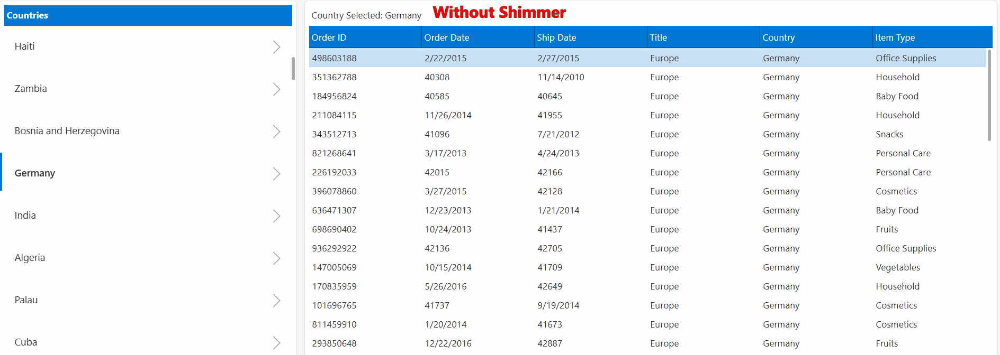

# SunilP-PowerApps-Shimmer 
# 💎 PowerShimmer Ultra-Light
> **A high-performance, zero-dependency skeleton loader for professional Power Apps.**

Part of the **SunilP.PowerApps-PCF** suite. This component replaces heavy Creator Kit dependencies with a native, ultra-lightweight CSS animation.


---

## ⬇️ Get Started

**Download the latest Power Platform solution package (ZIP):**

[](https://github.com/spashikanti/SunilP-PowerApps-Shimmer/releases/latest)
[](https://github.com/spashikanti/SunilP-PowerApps-Shimmer/releases/latest)
[](https://github.com/spashikanti/SunilP-PowerApps-Shimmer/releases)

---



## 🧐 The Problem: Why not the Creator Kit?
While Microsoft provides a Shimmer in the **Power CAT Creator Kit**, many enterprise environments and independent developers face significant friction using it. This project solves these specific "Real-World" pain points:

| Feature | Microsoft Creator Kit | **PowerShimmer Ultra-Light** |
| :--- | :--- | :--- |
| **Dependencies** | Requires the entire Creator Kit (~20MB+). | **Zero Dependencies.** Single PCF import. |
| **Setup** | Complex Power Fx Table definitions. | **Plug & Play.** Drag, drop, and resize. |
| **Performance** | Fluent UI Wrapper Overhead. | **Native CSS.** Ultra-low memory footprint. |

---

## ✨ Key Features
- **🚀 Ultra-Lightweight:** Native CSS animations. No bulky libraries.
- **🎨 Full Branding:** Bind background and highlight colors to your app’s global theme.
- **📐 Shape Variants:** Support for **Rectangle** (Cards/Tables) and **Circle** (Profile Icons).
- **⚡ No Pixelation:** Optimized rendering for high-resolution displays.

---

## 🚀 Quick Start (Installation & Usage)

### 1. Locate the Solution
- Download the `PowerShimmerSolution.zip` located in the `/SolutionPackage` folder of this repository. 
- *Note: This is an **unmanaged** solution, allowing you to inspect or extend the code directly in your environment.*

### 2. Import to Power Platform
- Go to [make.powerapps.com](https://make.powerapps.com) > **Solutions**.
- Click **Import Solution** and select the `.zip` file.
- **⚠️ Troubleshooting:** You may see a warning regarding "Critical Violations" or "Solution Checker." This is a standard warning for custom PCF code components. It is safe to click **Next** and proceed with the import.
- Once complete, click **Publish all customizations**.

### 3. Enable in your Canvas App
- In the App Editor, click the **+ (Insert)** icon > **Get more components**.
- Select the **Code** tab, find **PowerShimmerUltraLight**, and click **Import**.
- The component will now appear under the **Code components** section of your Insert pane.

### 4. Implementation Pattern
Place the Shimmer over your Gallery/Table and set the following properties:

- **Visible:** `varIsLoading`
- **ShapeType:** `0` (Rectangle) or `1` (Circle) `2` (Rounded Rectangle)

**The "Super User" Loading Logic:**
```powerapps
Set(varIsLoading, true); 
Refresh('YourDataSource'); 
Set(varIsLoading, false);
```

---

## 🤝 Community & Contribution
As a **Power Platform Super User**, I build these components to solve real-world architectural bottlenecks. Whether it's optimizing payload sizes or enhancing UI responsiveness, I'm always looking for better patterns. If you have ideas or optimizations, feel free to open a Pull Request!

# 👤 Author

**Sunil Kumar Pashikanti** *Principal Architect | Microsoft Power Platform Super User*

[](https://community.powerplatform.com/profile/?userid=8077d18b-7b47-ee11-be6d-6045bdebe084)
&nbsp;
[](https://www.linkedin.com/in/sunil-kumar-pashikanti/)
&nbsp;
[](http://sunilpashikanti.blogspot.com)
&nbsp;
[](https://sunilpashikanti.com)

**Support the Project:** If this solution helped you optimize your app, please consider giving it a ⭐ to help others find it!
